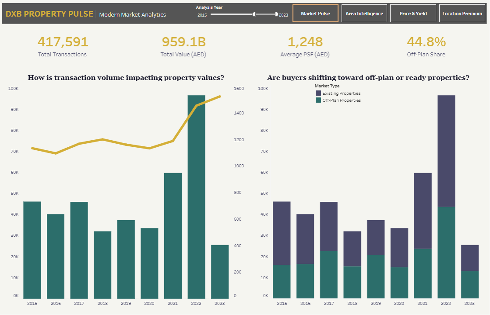
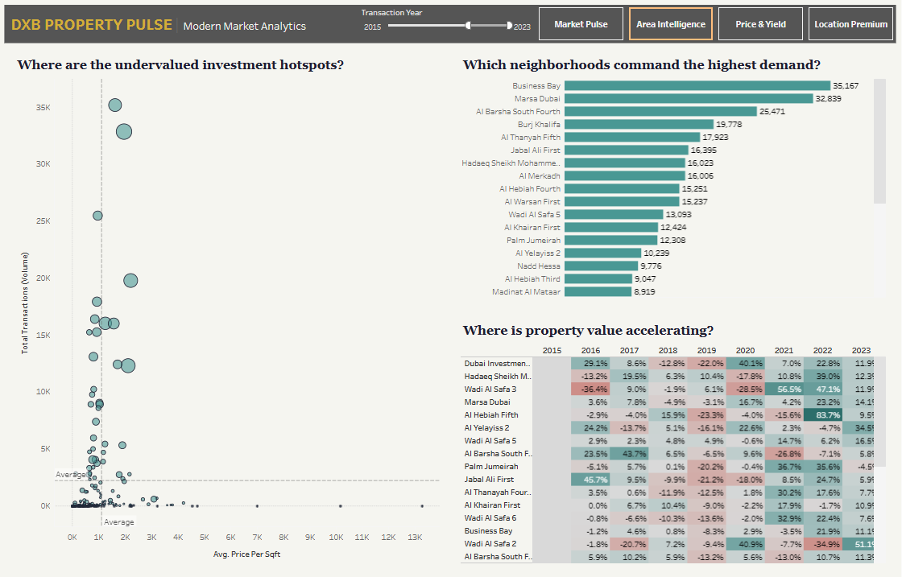
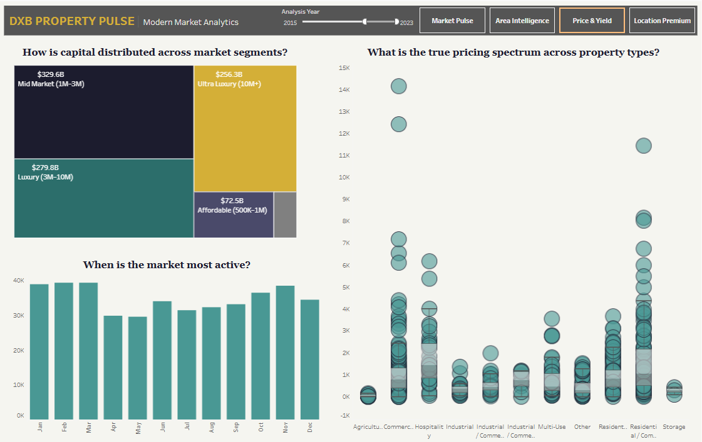
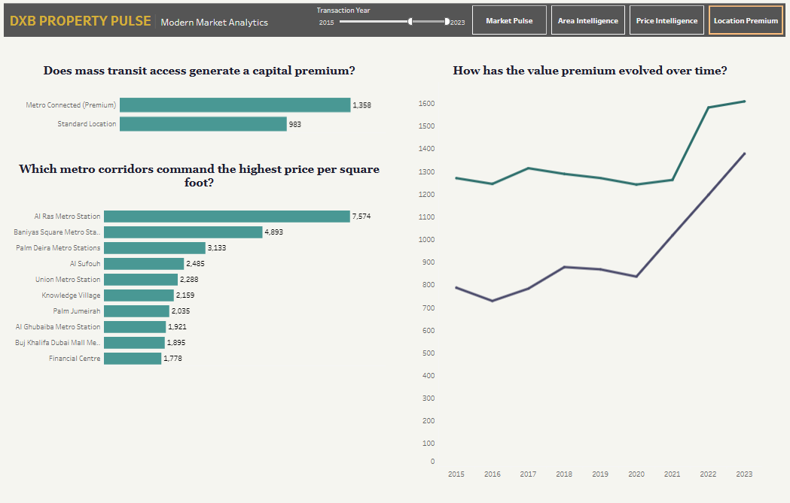

# DXB Property Pulse: Real Estate Market Intelligence 🏢📊

## Project Overview
Dubai is one of the fastest-moving real estate markets in the world. I built **DXB Property Pulse** to act as an enterprise-grade market intelligence tool for investors, developers, and analysts. 

Instead of relying on simple averages, this project processes over 800,000 raw transaction records from the Dubai Land Department to uncover the true financial pulse of the city. The application tracks macroeconomic trends, maps out neighborhood demand, visualizes the flow of capital across luxury and affordable segments, and calculates the exact financial premium of Transit-Oriented Development (TOD).

🔴 **Live Interactive Dashboard:** [View the full application on Tableau Public](https://public.tableau.com/views/DXBPropertyPulse19952023MarketAnalytics/Dashboard1?:language=en-US&:sid=&:redirect=auth&:display_count=n&:origin=viz_share_link)

---

## 🛠️ The Tech Stack
* **Database Management & Data Engineering:** PostgreSQL
* **Data Visualization & Analytics:** Tableau Public 
* **Data Source:** Dubai Land Department (DLD) via Kaggle

---

## 💡 Key Business Insights (2015–2023)

Through rigorous data cleaning and visual analytics, several high-value market realities were uncovered:

1. **The Macro Market Volume:** The modern market era saw **417,591 total transactions**, generating **959.1 Billion AED** in total value. Off-plan properties maintained a massive **44.8%** market share, proving sustained investor confidence in future developments.
2. **Demand Hubs vs. Value Surges:** **Business Bay** and **Marsa Dubai** are the undisputed leaders in raw transaction volume (exceeding 32K+ transactions each). However, specific pockets like **Al Hebiah Fifth** showed the most aggressive year-over-year acceleration, surging 83.7% in 2022.
3. **Capital Distribution:** The market is heavily anchored by the **Mid Market (1M–3M AED)** segment, which commands **329.6 Billion AED** of the total capital. The **Ultra-Luxury (10M+ AED)** tier follows closely at **256.3 Billion AED**, highlighting Dubai's dual appeal to both mid-tier professionals and high-net-worth individuals.
4. **The Transit Premium:** Proximity to mass transit is a major valuation driver. Properties located within **Metro-Connected Corridors** command a distinct capital premium (averaging 1,358 AED/sqft) compared to vehicle-dependent standard locations (averaging 983 AED/sqft), an infrastructure gap that continues to widen over time.

---

## ⚙️ Data Engineering Architecture
Raw real estate data requires extensive preparation before visual consumption. The SQL architecture for this project included:
* **Smart Imputation:** Developed conditional `CASE` statements to intelligently fill missing dimensions (e.g., assigning 'Not Applicable' to empty building names for raw land plots).
* **Feature Engineering:** Extracted temporal data for seasonality tracking and engineered custom geographic logic to cluster distinct neighborhoods into broader Transit Corridors.
* **Financial Segmentation:** Created calculated fields to automatically categorize properties into defined investment brackets (Entry Level to Ultra Luxury).

---

## 📬 Let's Connect
I am a Data Analytics professional specializing in transforming raw, complex databases into clean, actionable business intelligence tools. 

* **LinkedIn:** https://www.linkedin.com/in/mabdullah30/
  
---

## 📸 Dashboard Gallery

  <table>
    <tr>
      <td align="center">
        <b>1. Market Pulse</b> 
        
      </td>
      <td align="center">
        <b>2. Area Intelligence</b> 
        
      </td>
    </tr>
    <tr>
      <td align="center">
        <b>3. Price & Yield</b> 
        
      </td>
      <td align="center">
        <b>4. Location Premium</b> 
        
      </td>
    </tr>
  </table>

